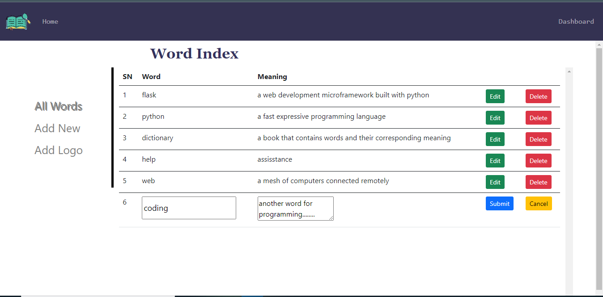

# Dictionary-App

My first full stack CRUD web application built with Python, MySQL, and Flask framework.

## Table of contents

- [Overview](#overview)
  - [The challenge](#the-challenge)
  - [Screenshot](#screenshot)
  - [Links](#links)
- [My process](#my-process)
  - [Built with](#built-with)
  - [What I learned](#what-i-learned)
  - [Useful resources](#useful-resources)
- [To use](#usage)

## Overview

### The challenge

Users should be able to:

- Check for the meaning of words.
- Add a new word with it's meaning to the dictionary.
- Update the a and its meaning.
- Delete a word from the dictionary
- View the optimal layout for the site depending on their device's screen size

### Screenshot





### Links

- Solution URL: (https://github.com/faozziyyah/Dictionary-app)
- Live link: (Not yet available)

## My process

### Built with

- HTML
- CSS
- Javascript
- [Flask](https://flask.palletsprojects.com/en/2.1.x/) - A web development microframework built with python
- MySQL

### What I learned

- How to connect to a database
- How to use the Jinja template

```js
$("#logo-form").submit(function() {
        let data = new FormData();
        data.append('file', $('#logo')[0].files[0]);

        $.ajax({
            url: '/add_logo',
            type: 'POST',
            data: data,
            enctype: 'multipart/form-data',
            processData: false,
            contentType: false,
            success: function(data) {
                location.reload();
            },
            error: function(err) {
                console.log(err);
            }
        })
    });
```

```Python
@app.route('/add_logo', methods=['POST'])
def add_logo():
    image = request.files['file']

    if image:
        filepath = os.path.join(current_app.root_path, 'static/images/logo.png')
        image.save(filepath)
        flash('image successfully added!')
    else:
        flash('error adding image!')

    return 'success'
```

```HTML
        <div class="modal-body text-center">
          
              <p>{{ message }}</p>
          
        </div>
```

### Useful resources

- [Flask](https://flask.palletsprojects.com/en/2.1.x/) - A web development microframework built with python
- [MySQL](https://www.mysql.com/) - The world's most popular open source database
